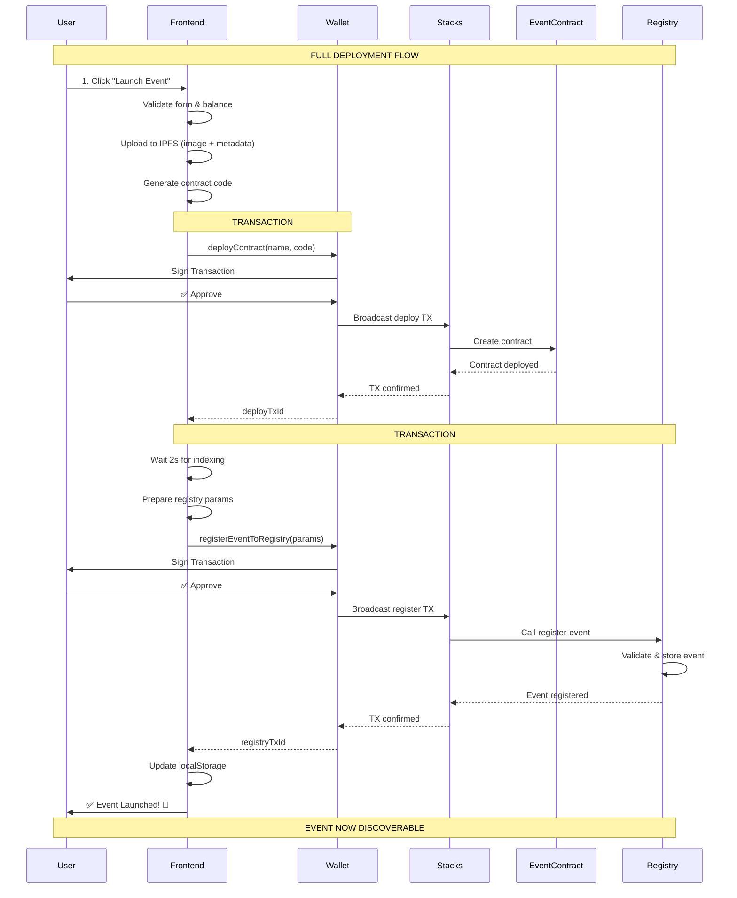
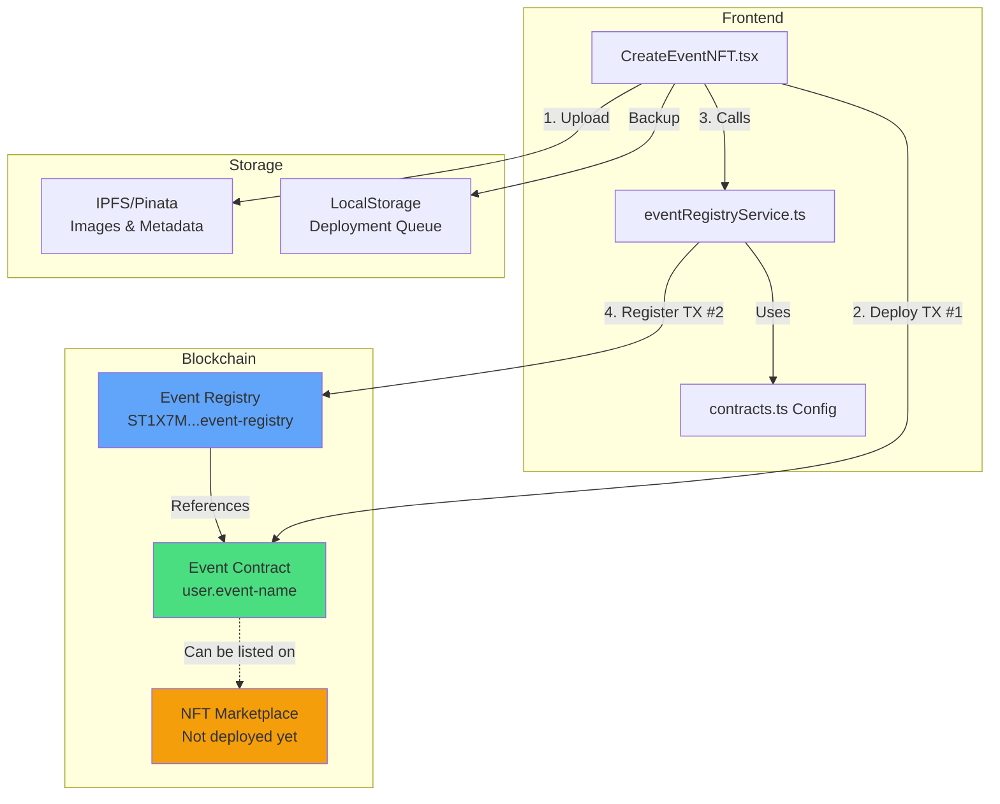
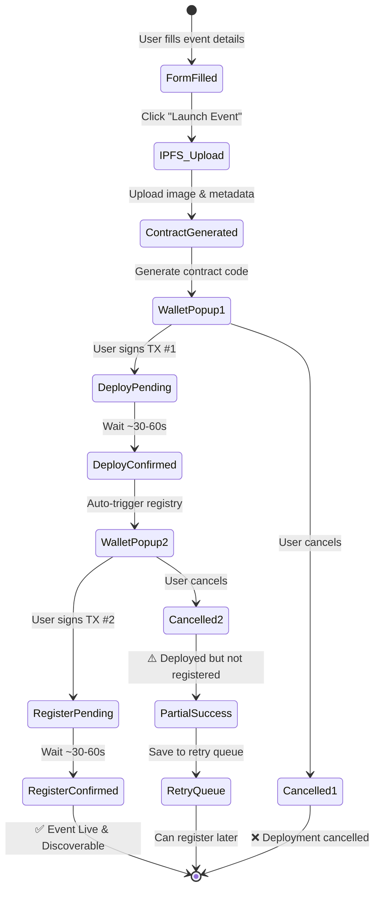

# Platform Architecture - 2 Transaction Flow



## Component Interaction



## Transaction Flow Detail



## Cost Breakdown

```
┌─────────────────────────────────────────────────┐
│          TRANSACTION COSTS                      │
├─────────────────────────────────────────────────┤
│                                                 │
│  TX #1: Contract Deployment                     │
│  ├─ Base Fee: ~0.20 STX                        │
│  └─ Gas: ~0.05 STX                             │
│     Total: ~0.25 STX ────────────────┐         │
│                                       │         │
│  TX #2: Registry Registration         │         │
│  ├─ Registry Fee: 0.01 STX            │         │
│  └─ Gas: ~0.001 STX                   │         │
│     Total: ~0.011 STX ────────────────┤         │
│                                       │         │
│  ─────────────────────────────────────┤         │
│  GRAND TOTAL: ~0.26 STX ◄─────────────┘         │
│                                                 │
│  User pays: 2 separate transactions             │
│  User clicks: 1 button ("Launch Event")         │
│  User signs: 2 times (auto-triggered)           │
│                                                 │
└─────────────────────────────────────────────────┘
```

## Data Flow

```
Event Data Flow:
================

1. Form Input (User)
   ├─ Event Name
   ├─ Date, Time, Venue
   ├─ Price, Supply
   ├─ Image
   └─ Description

2. IPFS Storage (Pinata)
   ├─ Image → ipfs://Qm...image
   └─ Metadata → ipfs://Qm...metadata

3. Contract Generation (Frontend)
   ├─ Template + User Data
   └─ Clarity Code (1000+ lines)

4. Blockchain Storage (Stacks)
   ├─ Event Contract
   │  ├─ NFT Definition
   │  ├─ Minting Logic
   │  └─ Metadata URIs
   │
   └─ Registry Contract
      ├─ Event Mapping
      ├─ Category Index
      ├─ Creator Index
      └─ Stats Tracking

5. Discovery (BrowseEvents)
   ├─ Read from Registry
   ├─ Display to All Users
   └─ Enable Minting
```

## Error Handling

```
Error Scenarios:
================

Scenario 1: Insufficient Balance
├─ Detection: Before TX #1
├─ Action: Show error, redirect to faucet
└─ Impact: ❌ No deployment

Scenario 2: Deployment Failed
├─ Detection: TX #1 fails
├─ Action: Show error, save to retry queue
└─ Impact: ❌ No contract, no registration

Scenario 3: User Cancels Deployment
├─ Detection: TX #1 cancelled
├─ Action: Show cancellation message
└─ Impact: ❌ No contract, no registration

Scenario 4: Deployment OK, Registry Fails
├─ Detection: TX #2 fails
├─ Action: Show warning, save to retry queue
└─ Impact: ✅ Contract deployed, ⚠️ Not discoverable

Scenario 5: User Cancels Registration
├─ Detection: TX #2 cancelled
├─ Action: Show warning, save to retry queue
└─ Impact: ✅ Contract deployed, ⚠️ Not discoverable

Scenario 6: Both Success
├─ Detection: Both TXs confirmed
├─ Action: Show success, redirect to event
└─ Impact: ✅ Fully functional & discoverable
```

## Files Modified/Created

```
Project Structure Changes:
==========================

✅ Created/Modified:
├─ src/config/contracts.ts
│  └─ Added EVENT_REGISTRY_CONTRACT config
│  └─ Updated DEPLOYMENT_COSTS
│
├─ src/services/eventRegistryService.ts [NEW]
│  └─ registerEventToRegistry()
│  └─ timestampToBlockHeight()
│  └─ getCurrentBlockHeight()
│
├─ src/pages/CreateEventNFT.tsx
│  └─ Import eventRegistryService
│  └─ Auto-register after deploy (line 982-1048)
│  └─ Updated cost display
│  └─ Enhanced error handling
│
├─ docs/TWO_TRANSACTION_FLOW.md [NEW]
│  └─ Complete documentation
│
├─ docs/ARCHITECTURE_DIAGRAMS.md [NEW]
│  └─ Visual diagrams (this file)
│
└─ docs/REGISTRY_DEPLOYED_NEXT_STEPS.md
   └─ Implementation guide

Contract Deployed:
==================
✅ ST1X7MNQF6TKA52PA7JRH99S9KKXH9TY8CSG8AK4C.event-registry-event

Pending Deployment:
===================
⏳ nft-marketplace.clar (for resale functionality)
```

---

**Status**: 🟢 **IMPLEMENTATION COMPLETE - READY FOR TESTING**
