# ❌ CRITICAL INTEGRATION ISSUE - Platform Tidak Terintegrasi!

## 🔍 Hasil Analisis

Saya telah mengecek ketiga komponen dan menemukan **MASALAH KRITIS**:

### ❌ **Event TIDAK Otomatis Register ke Event Registry!**

## 📊 Current Flow (BROKEN)


## ❌ Masalah yang Ditemukan

### 1. **CreateEventNFT.tsx - NO INTEGRATION**

```typescript
// Line 789 - COMMENTED OUT!
;; (try! (contract-call? event-registry-contract register-event
;;   ...
;; ))

// Placeholder - registry integration coming soon
(ok true)  // ❌ DOES NOTHING!
```

**Artinya**:
- ✅ NFT Contract berhasil di-deploy
- ❌ Event TIDAK didaftarkan ke Event Registry
- ❌ Event HANYA disimpan di localStorage (local browser only!)
- ❌ User lain TIDAK bisa lihat event ini
- ❌ Event TIDAK muncul di BrowseEvents
- ❌ Event TIDAK discoverable

### 2. **Event Registry - NOT CALLED**

Event Registry contract sudah bagus dan siap, tapi:
- ❌ Tidak pernah dipanggil dari CreateEventNFT.tsx
- ❌ Fungsi `register-event` tidak digunakan
- ❌ Registry tetap kosong

### 3. **NFT Marketplace - NO CONNECTION**

```clarity
;; NFT Marketplace TIDAK terhubung dengan:
- Event Registry (tidak tahu event apa yang ada)
- NFT Ticket contracts (tidak bisa verify ownership)
```

## ✅ Yang SEHARUSNYA Terjadi (CORRECT FLOW)

```mermaid
graph TD
    A[User Fill Form] --> B[Upload to IPFS]
    B --> C[Deploy NFT Ticket Contract]
    C --> D[✅ Register to Event Registry]
    D --> E[✅ Event Discoverable]
    E --> F[✅ Users Can Browse]
    F --> G[✅ Users Can Mint Tickets]
    G --> H[✅ Users Can Resell on Marketplace]
    
    style D fill:#51cf66
    style E fill:#51cf66
    style F fill:#51cf66
    style G fill:#51cf66
    style H fill:#51cf66
```



## 🔧 SOLUSI - 3 Step Fix

### Step 1: Update CreateEventNFT.tsx - Add Registry Integration

Tambahkan fungsi untuk register ke Event Registry AFTER deploy:

```typescript
// Add after line 860 (after deploy success)
const registerToEventRegistry = async (
  contractId: string,
  contractName: string
) => {
  try {
    console.log('📝 Registering to Event Registry...');
    
    const eventDateTimestamp = new Date(`${formData.eventDate} ${formData.eventTime}`).getTime();
    const eventDateBlocks = Math.floor(eventDateTimestamp / 1000 / 600); // Approx blocks
    
    const registryContract = 'ST1PQHQKV0RJXZFY1DGX8MNSNYVE3VGZJSRTPGZGM.event-registry-full-fixed';
    
    // Prepare coordinate string (latitude,longitude)
    const coordinates = selectedVenue?.coordinates 
      ? `${selectedVenue.coordinates.lat},${selectedVenue.coordinates.lon}`
      : "0,0";
    
    // Convert price to micro-units (STX uses 6 decimals)
    const priceInMicro = Math.floor(parseFloat(formData.ticketPrice) * 1000000);
    
    const functionArgs = [
      contractId,                                    // contract-address (principal)
      contractName,                                  // contract-name (string-ascii 128)
      formData.eventName,                           // event-name (string-utf8 256)
      formData.description || "No description",     // event-description (string-utf8 1024)
      formData.category,                            // category (string-ascii 64)
      formData.venue,                               // venue (string-utf8 256)
      formData.venueAddress || formData.venue,      // venue-address (string-utf8 512)
      coordinates,                                  // venue-coordinates (string-ascii 64)
      eventDateBlocks,                              // event-date (uint)
      priceInMicro,                                 // ticket-price (uint)
      parseInt(formData.totalSupply),               // total-supply (uint)
      imageIpfsUrl || "",                           // image-uri (string-ascii 256)
      metadataIpfsUrl || ""                         // metadata-uri (string-ascii 256)
    ];

    // Open contract call modal
    await openContractCall({
      contractAddress: registryContract.split('.')[0],
      contractName: registryContract.split('.')[1],
      functionName: 'register-event',
      functionArgs: functionArgs,
      network: currentNetwork,
      onFinish: (data) => {
        console.log('✅ Registered to Event Registry:', data);
        toast.success('Event registered to platform!');
      },
      onCancel: () => {
        console.log('❌ Registration cancelled');
        toast.warning('Event deployed but not registered. You can register later.');
      }
    });
    
  } catch (error) {
    console.error('❌ Failed to register to Event Registry:', error);
    toast.error('Event deployed successfully but registration failed. You can try again later.');
  }
};
```

**Integrate in handleDeployContract**:

```typescript
// After successful deployment (around line 920)
if (deployedContract) {
  // ... existing code ...
  
  // ✅ NEW: Register to Event Registry
  await registerToEventRegistry(contractId, contractName);
  
  // ... rest of the code ...
}
```

### Step 2: Update NFT Ticket Contract Template

Remove the placeholder and make register function callable:

```clarity
;; Register to event registry (can be called by owner after deployment)
(define-public (register-to-platform)
  (begin
    (asserts! (is-eq tx-sender contract-owner) err-owner-only)
    (ok true)
  )
)

;; Helper: Get full event data for manual registry
(define-read-only (get-registry-data)
  (ok {
    contract-name: "${contractName}",
    event-name: (var-get event-name),
    description: "${formData.description.replace(/"/g, '\\"').substring(0, 500)}",
    category: "${formData.category}",
    venue: (var-get event-venue),
    venue-address: (var-get venue-address),
    venue-coordinates: (var-get venue-coordinates),
    event-date: (var-get event-date),
    ticket-price: ticket-price,
    total-supply: total-supply,
    image-uri: (var-get event-image-uri),
    metadata-uri: (var-get token-uri),
    creator: contract-owner
  })
)
```

### Step 3: Connect Marketplace to Registry

Add functions in NFT Marketplace to check Event Registry:

```clarity
;; Check if event is registered and active
(define-read-only (is-event-registered (contract-address principal))
  (match (contract-call? .event-registry-full-fixed get-event-by-contract contract-address)
    success (ok (is-some success))
    error (ok false)
  )
)

;; Get event details from registry
(define-read-only (get-event-info (contract-address principal))
  (contract-call? .event-registry-full-fixed get-event-by-contract contract-address)
)

;; Update list-fixed-price to verify event registration
(define-public (list-fixed-price
  (token-id uint)
  (contract-address principal)
  (price uint)
  (royalty-percentage uint)
  (metadata-uri (optional (string-ascii 256)))
)
  (let ((listing-id (+ (var-get listing-counter) u1)))
    (asserts! (> price u0) ERR-INVALID-PRICE)
    (asserts! (<= royalty-percentage u1000) ERR-INVALID-PRICE)
    
    ;; NEW: Verify event is registered (optional - can be commented out)
    ;; (asserts! (unwrap! (is-event-registered contract-address) ERR-NOT-LISTED) ERR-NOT-LISTED)
    
    ;; Verify ownership through NFT contract call
    ;; ... rest of code ...
  )
)
```

## 📋 Implementation Checklist

### Frontend (CreateEventNFT.tsx):
- [ ] Add `registerToEventRegistry` function
- [ ] Import `openContractCall` from Stacks Connect
- [ ] Call registry after successful deployment
- [ ] Handle registration fee (0.01 STX)
- [ ] Show registration status to user
- [ ] Handle registration errors gracefully
- [ ] Update UI flow with registration step

### Smart Contracts:
- [ ] Update NFT Ticket template (remove placeholder)
- [ ] Add registry verification to marketplace (optional)
- [ ] Deploy Event Registry contract first
- [ ] Test end-to-end flow

### Testing:
- [ ] Test deploy + register flow
- [ ] Test browsing registered events
- [ ] Test minting from registered events
- [ ] Test listing on marketplace
- [ ] Test resale flow

## 💰 Cost Breakdown

1. **Deploy NFT Contract**: ~0.5-1 STX (gas fees)
2. **Register to Event Registry**: 0.01 STX (registration fee) + ~0.05 STX gas
3. **Total per Event**: ~0.56-1.06 STX

## 🎯 Expected Benefits After Fix

✅ **Discoverability**:
- Events automatically appear in BrowseEvents
- Other users can discover and mint tickets

✅ **Platform Features**:
- Event verification badges
- Featured events curation
- Category browsing
- Search functionality

✅ **Marketplace Integration**:
- Verify tickets belong to real events
- Show event details on marketplace
- Track sales volume per event

✅ **Analytics**:
- Total minted tickets
- Total sales volume
- Floor prices
- Trending events

## ⚠️ Current State

**Status**: 🔴 **CRITICAL - Platform Tidak Terintegrasi**

- Events deployed ✅
- Events registered ❌
- Events discoverable ❌
- Marketplace connected ❌
- Full platform flow ❌

## 🚀 Deployment Priority

**HIGH PRIORITY - Must fix before production!**

1. **Deploy Event Registry** (if not deployed)
2. **Update CreateEventNFT.tsx** with registry integration
3. **Test end-to-end** flow
4. **Update documentation** for users

---

**Kesimpulan**: 
Platform sudah punya semua komponen yang diperlukan, tapi **TIDAK TERINTEGRASI**. Event hanya di localStorage, tidak on-chain discoverable. Perlu implement registry call setelah deployment!
