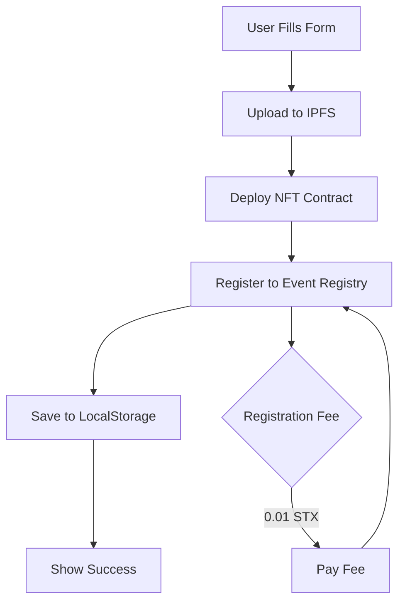

# 🔧 Critical Fixes: NFT Marketplace & Event Registry Integration

## ❌ Masalah yang Ditemukan

### 1. **NFT Marketplace Contract - Invalid Block Info Usage**

**Error**: `(get-block-info? time u0)` adalah INVALID di Clarity

```clarity
❌ WRONG:
listed-at: (unwrap-panic (get-block-info? time u0))

✅ CORRECT:
listed-at: burn-block-height
```

**Penjelasan**:
- `get-block-info?` hanya bisa digunakan untuk mendapatkan informasi dari block tertentu
- Parameter `time` tidak valid untuk `get-block-info?`
- Untuk timestamp, gunakan `burn-block-height` langsung

### 2. **CreateEventNFT.tsx - Missing Event Registry Integration**

**Masalah**:
- Contract NFT di-deploy ✅
- **TAPI** tidak didaftarkan ke Event Registry ❌
- Event data hanya di localStorage (tidak on-chain) ❌
- Tidak bisa di-discover oleh user lain ❌

**Yang Seharusnya Terjadi**:
1. Deploy NFT Ticket Contract ✅
2. **Register ke Event Registry** ← MISSING!
3. Save to localStorage ✅

## ✅ Solusi

### Fix 1: Perbaiki NFT Marketplace Contract

Ganti semua `(get-block-info? time u0)` dengan `burn-block-height`

### Fix 2: Tambahkan Event Registry Integration di CreateEventNFT.tsx

Setelah deploy contract, harus call `register-event` di event-registry:

```typescript
// After successful deployment
const registerToEventRegistry = async (
  contractAddress: string,
  contractName: string
) => {
  const registryContract = 'ST1PQHQKV0RJXZFY1DGX8MNSNYVE3VGZJSRTPGZGM.event-registry-full-fixed';
  
  const functionArgs = [
    contractAddress,              // contract-address
    contractName,                 // contract-name
    formData.eventName,          // event-name
    formData.description,        // event-description
    formData.category,           // category
    formData.venue,              // venue
    formData.venueAddress,       // venue-address
    venueCoordinates,            // venue-coordinates
    eventDateBlock,              // event-date (as block height)
    ticketPriceInMicroUnits,     // ticket-price
    totalSupply,                 // total-supply
    imageIpfsUrl,                // image-uri
    metadataIpfsUrl              // metadata-uri
  ];

  await openContractCall({
    contract: registryContract,
    functionName: 'register-event',
    functionArgs: functionArgs,
    network: currentNetwork,
  });
};
```

## 📋 Implementation Checklist

### NFT Marketplace Contract:
- [ ] Replace all `(get-block-info? time u0)` with `burn-block-height`
- [ ] Test all listing functions
- [ ] Test auction functions
- [ ] Test bundle sales
- [ ] Deploy updated contract

### CreateEventNFT.tsx:
- [ ] Add event registry integration function
- [ ] Call register-event after deployment
- [ ] Handle registration fee (0.01 STX)
- [ ] Show registration status to user
- [ ] Handle errors gracefully
- [ ] Update UI flow

## 🎯 Updated Flow



## 💰 Costs

1. **Deploy NFT Contract**: ~0.5-1 STX (gas fees)
2. **Register to Event Registry**: 0.01 STX (registration fee) + gas
3. **Total**: ~0.51-1.01 STX per event

## ⚠️ Breaking Changes

None - these are additions and fixes that improve functionality.

## 📝 Next Steps

1. Fix marketplace contract
2. Update CreateEventNFT.tsx
3. Test end-to-end flow
4. Deploy to testnet
5. Test discovery features
6. Deploy to mainnet

---

**Status**: 🔴 **CRITICAL - Requires immediate fix**  
**Impact**: Events not discoverable, marketplace timestamps broken
